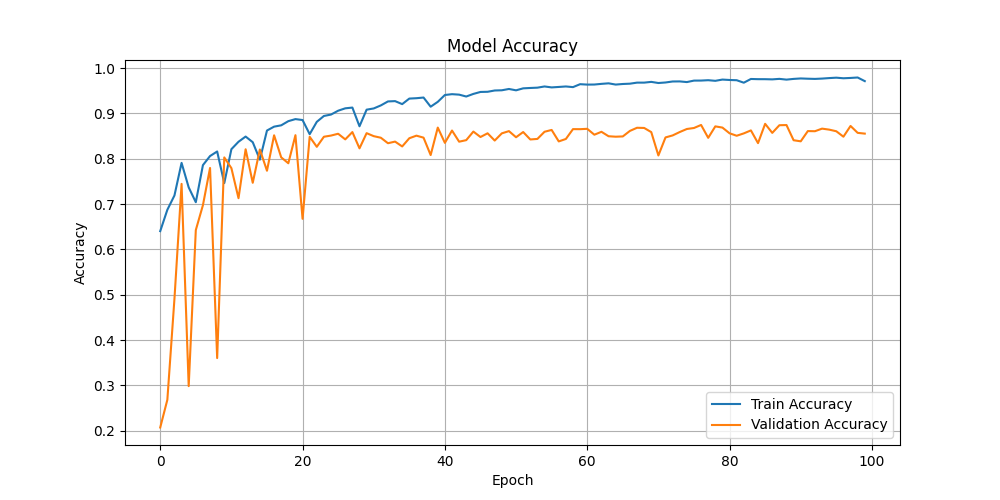
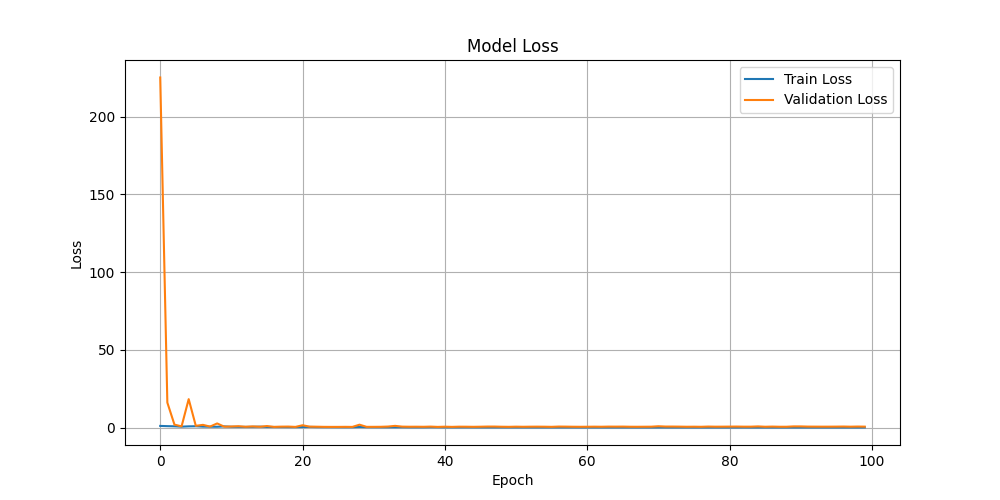

## 🎯 Problem Statement

> Can a deep learning model accurately classify small (32x32) images into the correct object category?

---

## 🧠 Model Architecture

- Input: 32x32x3 images
- Several Conv2D + MaxPooling layers
- Dropout layers to prevent overfitting
- Fully connected Dense layers
- **Optimizer**: Adam
- **Loss Function**: Categorical Crossentropy
- **Evaluation Metric**: Accuracy

---

## 📊 Performance

- ✅ Final Training Accuracy: **97.80%**
- ✅ Best Validation Accuracy: **87.24%**
- ✅ Model Saved as: model/cifar_10_classification.h5

---

## 📷 Visual Results

### 🔹 Accuracy & Loss Curve

### 🔹 Confusion Matrix

### 🔹 Sample Predictions

---

## 📦 Folder Structure
  and # 🧠 CNN Image Classification on CIFAR-10 using TensorFlow

This project demonstrates how to build and train a **Convolutional Neural Network (CNN)** using **TensorFlow/Keras** to classify 32x32 images from the **CIFAR-10 dataset** into 10 object categories.

---

## 📂 Dataset

- **Source**: [CIFAR-10 Dataset](https://www.cs.toronto.edu/~kriz/cifar.html)
- **Size**: 60,000 color images (32x32 pixels) in 10 classes
- **Split**: 50,000 training and 10,000 testing images
